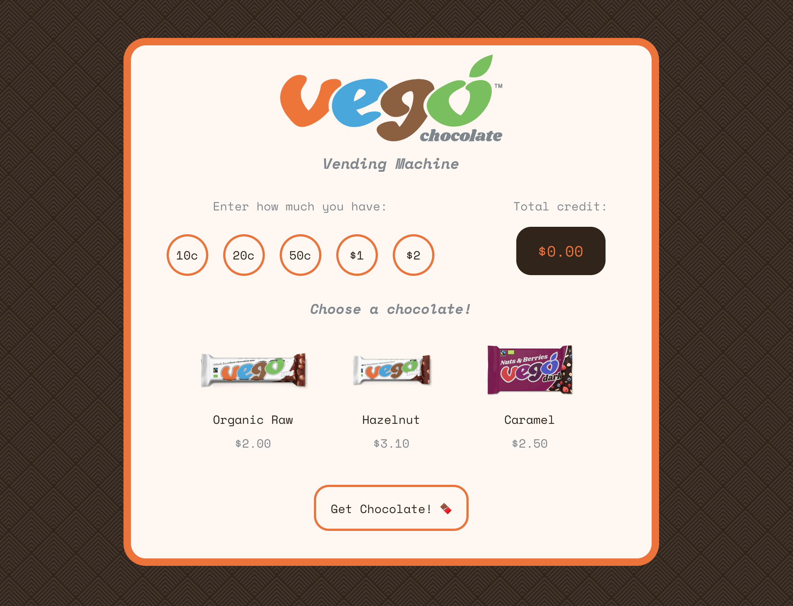

# Vego Vending Machine 🍫
### 100% Vegan Chocolates

## Live demo

Pick your favourite, 100% vegan, chocolates here: [Visit the Vego Vending Machine](https://oisa.github.io/vego-vending-machine/).

## General Notes

I've attempted the solution using React not only due to its relevance to the company, though also due to my goal of learning React as much as I possibly can.

I've opted for the GUI as I wanted to create the experience and see how the solution could materialise here. Users can input the coins they have and will see their total credit amount calculated in the dark brown box. Users can then select from the 3 available options, and will be able to retrieve their desired chocolate(s).

Users' change will be calculated on purchase and maintained within their total credit.

### Error handling
Users will not be able to proceed with their order, retrieving their desired chocolate until either an equal or greater amount of credit is input by the user via the preset coin amounts. This also decreases the chance of user error during the input process, stopping prospects of a 5c piece from being input.

### Testing

I had learnt TDD within vanilla JS environment, so writing effective tests in React this round was new for me so it doesn't reflect the attempt and trying to test all the critical functions in the app. This will be worked on moving forward!

## Additional features

- Ability for users to retrieve their change from the vending machine at any point.
- A 'total chocolate bars' section showing all the chocolate bars the user has purchased in a session.

## Areas that need work

- Better testing. As mentioned above, ideally I'd like to test all functions in the app, particularly the ones that relate to clearly defined requirements within the brief (in this case, figuring out how to test the system to not allow for the possibility of a 5c coin entry from the user).
- I used a class component here, though perhaps a functional component using hooks to store users' choices may be ultimately the cleanest solution. I ran with the class component as this was the initial basis of my React knowledge, however I aim to continue to increase my understanding as to which is best, and when and why they should be used.
- Responsiveness - I didn't dedicate time to add media queries for the optimal experience on mobile for the user. I have hopefully arranged the elements on the page to allow for this task not to be too large.
- I considered hiding the chocolates until the user had inputted enough to afford a given chocolate bar, however given there are only 3 options, this wasn't a great user experience given the initial load of the page would mean all chocolate bars would be faded/hidden. Instead I opted for error messages to show if they didn't satisfy the requirements of a purchase.

Thank you and full credit for the branding to [Vego](https://vego-chocolate.com/au), a vegan chocolate brand with lots of great products. You will also note that the images don't exactly show the flavours mentioned - if the context were real, this would of course show the correct flavours :)

I hope you enjoy the Vego Vending Machine! 🍫
